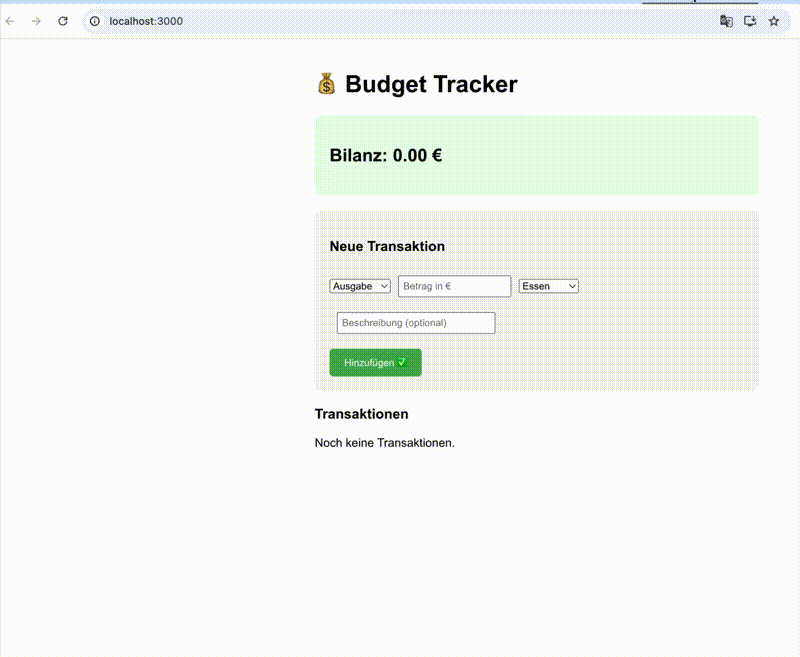

# 💰 Budget Tracker




A full-stack web application to track personal income and expenses. Built with React and Python Flask.

---

## ✨ Features

- Add income and expense transactions
- Organize by category (Food, Rent, Transport, etc.)
- Live balance calculation with color feedback
- Delete transactions

---

## 🛠️ Technologies

**Frontend:** React · Axios

**Backend:** Python · Flask · Flask-CORS · SQLite

---

## ⚙️ Installation & Setup

### Prerequisites
- Node.js
- Python 3

### 1. Clone the repository
```bash
git clone https://github.com/saifan340/budget-tracker.git
cd budget-tracker
```

### 2. Start the Backend
```bash
cd backend
python3 -m venv .venv
source .venv/bin/activate
pip install flask flask-cors
python3 app.py
```
Backend runs on: `http://localhost:8000`

### 3. Start the Frontend
Open a new terminal:
```bash
cd frontend
npm install
npm start
```
Frontend runs on: `http://localhost:3000`

---

## 🚀 Planned Features

- [ ] AI-powered spending analysis using GenAI
- [ ] Charts and data visualization
- [ ] User authentication & login
- [ ] Monthly budget goals
- [ ] Export data to CSV

---

## 👩‍💻 Author

**Saifan** — [GitHub](https://github.com/saifan340) · [LinkedIn](https://linkedin.com/in/saifan-aremenak)